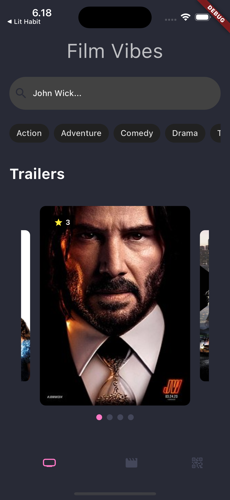
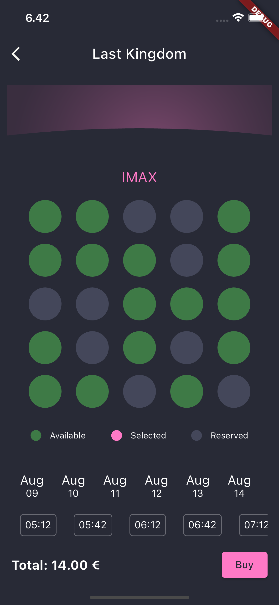

# Film Vibes Cinema Ticket App

Film Vibes is a comprehensive cinema ticket app designed to provide an immersive and convenient movie-going experience for users. Whether you're a cinephile or someone looking for a simple way to book tickets and explore movies, Film Vibes has you covered. With its user-friendly interface and a range of features, Film Vibes aims to make your movie experience enjoyable and hassle-free.

## Features

### Movie Discovery

-  Easily search for movies by their name or genre. Browse through an extensive collection of current and upcoming films.

### Cinema Screen Booking

- **Book Cinema Screens**: Seamlessly book cinema screens for your favorite movies. Choose showtimes, select seats, and complete your booking in just a few taps.

- **Seat Selection**: View the available seats for each cinema screen and select your preferred seats for you and your companions.

### Ticket Management

- **Current and Expired Tickets**: Keep track of your movie tickets. View your upcoming screenings and access information about your past movie experiences.

### User-Friendly Interface

- **Intuitive Design**: The app's interface is designed with user convenience in mind, making it easy for users of all levels to navigate and utilize its features.

- **Customizable Preferences**: Customize your movie-watching experience by adjusting settings such as preferred genres and notification preferences.

## Screenshots

| Movie Discovery Screen | Cinema Screen Booking | Ticket |
|------------------------|-----------------------|-------------------|
|  |  |  |

## Installation

1. Clone the repository: `git clone https://github.com/ramialkaro/filmvibes-app`
2. Install the dependencies: `cd filmvibes-app && flutter pub get`
3. Run the app: `flutter run`

## Feedback and Support

We value your feedback and suggestions to enhance the Film Vibes experience. If you encounter any issues or need assistance, please create a new issue on the GitHub repository.

## License

This project is licensed under the [MIT License](LICENSE). Your movie journey with Film Vibes awaits!
